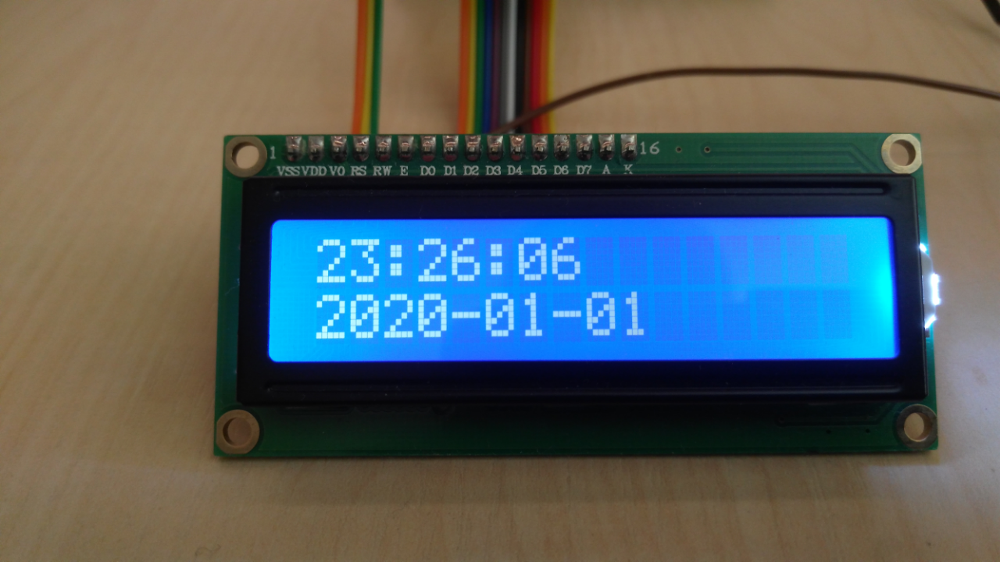
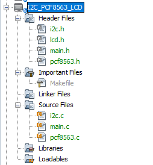
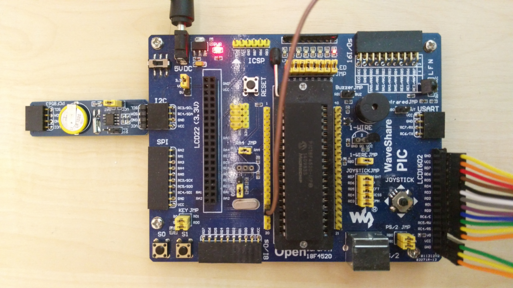
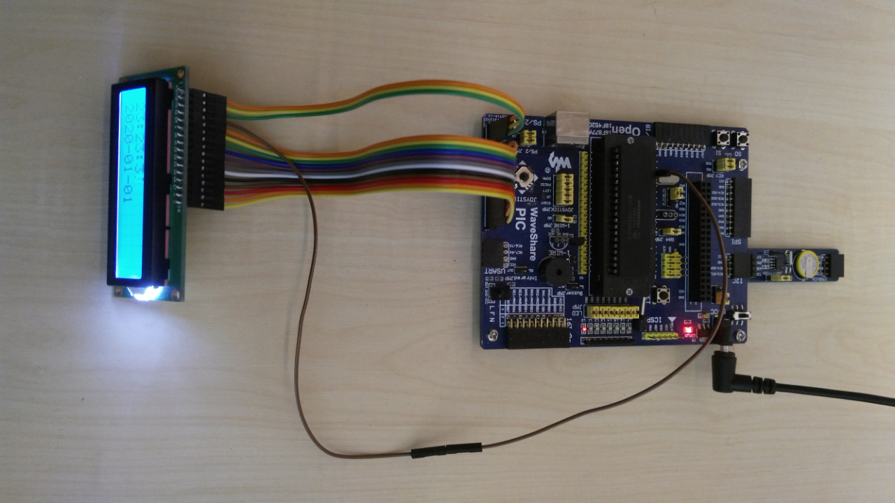

# Real-time clock PCF8563 with the output to LCD 16x02

## Description
Information about time and date is read from I2C and shown on the display.
Initial time is hard-coded and can't be changed by pressing buttons etc.

     

## Install
Create new project and add *c and *h files into appropriate project folders.

## Settings
- Set power supply voltage to 3.3V
- Connect PCF8563 to I2C slot
- Connect LCD display to LCD1602 slot by using wires. **Don't plug the display directly to the LCD1602** slot. Instead of using RC4 as RS use RC2 on pin 17.

Wiring between the display and the LCD1602 slot can be seen in the following picture:
 

